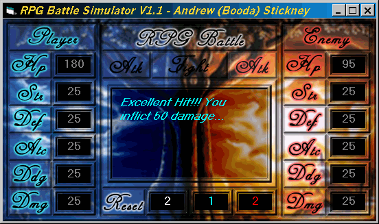



## RPG Battle Simulator V1\.1

### Description

This program will simulate RPG Battles with a real good battle calculator. This version has 6 stats, now, including HP, Str, Def, Atc, Ddg, and Dmg. I have uprgraded the battles to have 3 types of strikes, like normal, double, and Excellent. Also I have made the battles have more random possibilitys, so if the players are equal, there is a random chance of one winning and one losing, and the battles have more of an exciting appeal. Also added a counter that tallys, turns, player wins, and enemie wins. Ive rearanged the graphics to fit the style better. And i heavily commented it, so anybody can cipher the math. I hope you enjoy this version better, it is more suited for rpg veterans, and even beginners to the genre and there is always room to expand it. Thank you and enjoy!
 
### More Info
 

             |
---                |---
**Submitted On**   |2003-07-31 01:30:56
**By**             |[Andrew Stickney](https://github.com/Planet-Source-Code/PSCIndex/blob/master/ByAuthor/andrew-stickney.md)
**Level**          |Intermediate
**User Rating**    |5.0 (10 globes from 2 users)
**Compatibility**  |VB 5\.0
**Category**       |[Games](https://github.com/Planet-Source-Code/PSCIndex/blob/master/ByCategory/games__1-38.md)
**World**          |[Visual Basic](https://github.com/Planet-Source-Code/PSCIndex/blob/master/ByWorld/visual-basic.md)
**Archive File**   |[RPG\_Battle1621977312003\.zip](https://github.com/Planet-Source-Code/andrew-stickney-rpg-battle-simulator-v1-1__1-47279/archive/master.zip)

